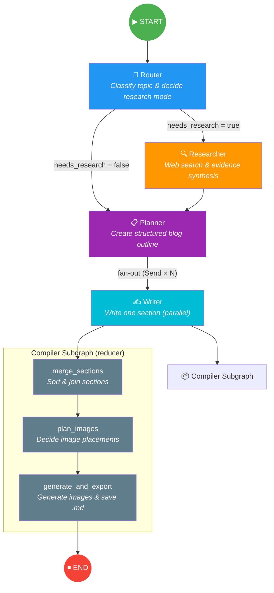

# 🔄 LangGraph Workflow — Autonomous Blog Writing Agent

## Graph Topology



---

## State Schema (`BlogState`)

| Field | Type | Reducer | Set By | Description |
|---|---|---|---|---|
| `topic` | `str` | — | Input | Blog topic provided by the user |
| `status` | `str` | — | All nodes | Current pipeline stage for observability |
| `mode` | `str` | — | Router | `closed_book`, `hybrid`, or `open_book` |
| `needs_research` | `bool` | — | Router | Whether web research is needed |
| `queries` | `List[str]` | — | Router | Search queries for the researcher |
| `evidence` | `List[EvidenceItem]` | `operator.add` | Researcher | Synthesised evidence from web search |
| `plan` | `Optional[Plan]` | — | Planner | Structured blog outline with tasks |
| `as_of` | `str` | — | Input | ISO date for recency control |
| `recency_days` | `int` | — | Router | How many days back to consider sources |
| `sections` | `List[tuple[int, str]]` | `operator.add` | Writer (×N) | `(task_id, section_markdown)` pairs |
| `merged_md` | `str` | — | Compiler | Joined markdown document |
| `md_with_placeholders` | `str` | — | Compiler | Markdown with `[[IMAGE_N]]` placeholders |
| `image_specs` | `List[dict]` | — | Compiler | Image generation specifications |
| `final` | `str` | — | Compiler | Final rendered blog with images |

> **Reducer fields** (`sections`, `evidence`) use `operator.add` — parallel nodes append results without conflicts.

---

## Node Descriptions

### 1. Router (`router_node`)
**File:** `blog_agent/agents/router.py`
**Status:** `routing`

Classifies the topic into one of three modes and decides whether web research is needed:
- **`closed_book`** — evergreen concepts, no web lookup needed
- **`hybrid`** — mostly evergreen but benefits from current examples
- **`open_book`** — volatile/news topics requiring fresh data

Produces search queries (3–10) when research is enabled.

---

### 2. Researcher (`researcher_node`)
**File:** `blog_agent/agents/researcher.py`
**Status:** `researching`

Runs Tavily web searches for each query from the router and synthesises raw results into structured `EvidenceItem` objects using the LLM. Deduplicates by URL and enforces recency cutoffs for `open_book` mode.

---

### 3. Planner (`planner_node`)
**File:** `blog_agent/agents/planner.py`
**Status:** `planning`

Generates a structured `Plan` with 5–9 sections (`Task` objects), each containing:
- Title, goal, bullet points, target word count
- Flags: `requires_research`, `requires_citations`, `requires_code`

Uses `fanout_to_writers()` to dispatch one `Send` per task for parallel writing.

---

### 4. Writer (`writer_node`)
**File:** `blog_agent/agents/writer.py`
**Status:** `writing`

Writes a single blog section in markdown. Runs in parallel (one instance per planned task via LangGraph's fan-out pattern). Returns `(task_id, section_md)` tuples that the `operator.add` reducer concatenates.

---

### 5. Compiler Subgraph
**File:** `blog_agent/agents/compiler.py`
**Status:** `compiling` → `done`

A three-step reducer subgraph that runs sequentially after all writers finish:

| Sub-node | Purpose |
|---|---|
| `merge_sections` | Sort sections by `task_id` and join into one markdown document |
| `plan_images` | LLM decides where to insert image placeholders (`[[IMAGE_N]]`) |
| `generate_and_export` | Generate images (Gemini → Pillow fallback), replace placeholders, export `.md` |

---

## Conditional Edges

| From | Condition | Target |
|---|---|---|
| `router` | `needs_research == True` | `researcher` |
| `router` | `needs_research == False` | `planner` |
| `planner` | Fan-out (`Send` × N tasks) | `writer` (parallel) |

---

## Execution Flow Example

```
User Input: "Latest trends in AI agents — March 2026"
    │
    ▼
[Router] → mode=open_book, needs_research=true, 6 queries
    │
    ▼
[Researcher] → 18 raw results → 12 deduplicated EvidenceItems
    │
    ▼
[Planner] → Plan with 7 sections, blog_kind=news_roundup
    │
    ├──► [Writer #1] → "## Introduction"
    ├──► [Writer #2] → "## Multi-Agent Frameworks"
    ├──► [Writer #3] → "## Tool Use Evolution"
    │    ...
    └──► [Writer #7] → "## Conclusion"
              │
              ▼
       [merge_sections] → single markdown doc
              │
              ▼
       [plan_images] → 2 image placeholders
              │
              ▼
       [generate_and_export] → final blog.md + images/
```
